# 🔍 Self Digital Identity Audit (SDIA)

[](LICENSE)
[](https://github.com/[org]/self-digital-identity-audit)
[](https://azure.microsoft.com)
[](CONTRIBUTING.md)
[](CONTRIBUTING.md)

> **Education over surveillance. Consent before inspection.**

SDIA is an open-source tool that generates an **educational and actionable report** about a minor's digital footprint across social networks and gaming platforms. The minor audits their **own** accounts with family accompaniment, receives a password-protected PDF, and learns to manage their digital identity safely.

---

## ✨ What does SDIA do?

1. **The minor registers** their email and primary nickname → receives a validation link
2. **Verifies ownership** of each account they want to audit (proof-of-possession, no credentials)
3. **SDIA analyzes** their digital footprint on public platforms using ethical OSINT
4. **Generates a PDF report** with a risk traffic light, Oversharing Score, and pedagogical social engineering simulator
5. **The PDF is delivered by email**, password-protected and ready to review with their family

---

## 🏗️ Architecture

```mermaid
flowchart TD
    USER([👤 Minor — User])

    subgraph BLOCK1["Block 1 · User Interaction & Always-On API"]
        direction TB
        GH["GitHub Pages\nVite + React + TypeScript\nStatic SPA"]
        API["Node.js Fastify API\nAzure Container Apps\nScale-to-Zero"]
        CRON(["⏰ Internal Scheduler\nnode-cron · 10:00 AM UTC-6"])
        DB[("Cosmos DB Serverless\nNoSQL · Partition /requestId\nTTL auto-purge 48 h")]
        ACS["Azure Communication Services\nTransactional Email"]
        KV["Azure Key Vault\nManaged Identity"]
        API -.- KV
    end

    subgraph BLOCK2["Block 2 · Report Generation — Ephemeral IaaS (On-Demand)"]
        direction TB
        BICEP["Bicep IaC\nAzure Dynamic Provisioner"]
        ORCH["Python FastAPI\nReport Orchestrator\nAzure Container Apps Job"]
        OSINT["OSINT Module\nMaigret · httpx"]
        LLM["Azure OpenAI\ngpt-4o-mini · AI Foundry"]
        PDF["Report Builder\nWeasyPrint · pikepdf\nAES-256 PDF"]
        BLOB[("Azure Blob Storage\nTemp PDFs · SAS URL · TTL 48 h")]
        RECON["Workflow Reconciliation\nState Cleanup · Bicep Teardown"]
    end

    %% ── Flow A · Registration & Email Validation (① ②)
    USER -->|"① Request report"| GH
    GH -->|"POST /api/jobs"| API
    API -->|"status: PENDING_EMAIL_VALIDATION"| DB
    API -->|"Send OTP link"| ACS
    ACS -->|"Email → link to GitHub Pages"| USER
    USER -->|"② Click link · token in URL"| GH
    GH -->|"GET /validate-email?token"| API
    API -->|"status: EMAIL_VALIDATED"| DB

    %% ── Flow B · Platform Ownership Validation (③ ④)
    USER -->|"③ Select platforms\n④ Validate each account"| GH
    GH -->|"POST /platforms/:p/verify\n(loop per platform)"| API
    API -->|"status: COLLECTING_PLATFORMS\n→ READY_TO_REPORT"| DB

    %% ── Flow C · Cron Detection & Ephemeral Provisioning (⑤ ⑥)
    CRON -->|"⑤ Query READY_TO_REPORT jobs"| DB
    CRON -->|"⑥ N > 0: provision infra"| BICEP
    BICEP -->|"Deploy Container Apps Job"| ORCH

    %% ── Flow D · Report Generation Pipeline
    ORCH -->|"OSINT extraction"| OSINT
    ORCH -->|"Atomic LLM inference"| LLM
    LLM --> ORCH
    ORCH -->|"HTML → PDF + AES-256 password"| PDF
    PDF -->|"Upload"| BLOB
    BLOB -->|"SAS URL"| ORCH

    %% ── Flow E · Delivery & Reconciliation (⑦ ⑧)
    ORCH -->|"⑦ PDF + password"| ACS
    ACS -->|"Report delivered"| USER
    ORCH -->|"Notify completion"| RECON
    RECON -->|"⑧ status: REPORT_READY"| DB
    RECON -->|"Teardown ephemeral infra"| BICEP

    %% ── Node styles
    classDef user     fill:#1D4ED8,stroke:#1E3A8A,color:#fff,font-weight:bold
    classDef frontend fill:#0369A1,stroke:#075985,color:#fff
    classDef backend  fill:#0A2342,stroke:#1E40AF,color:#fff
    classDef data     fill:#6D28D9,stroke:#5B21B6,color:#fff
    classDef comms    fill:#B45309,stroke:#92400E,color:#fff
    classDef cron     fill:#15803D,stroke:#166534,color:#fff,font-weight:bold
    classDef kv       fill:#374151,stroke:#1F2937,color:#fff
    classDef bicep    fill:#991B1B,stroke:#7F1D1D,color:#fff,font-weight:bold
    classDef orch     fill:#7C2D12,stroke:#6C1D12,color:#fff
    classDef process  fill:#9A3412,stroke:#7C2D12,color:#fff
    classDef storage  fill:#4C1D95,stroke:#3B0764,color:#fff
    classDef recon    fill:#1F2937,stroke:#111827,color:#fff

    class USER user
    class GH frontend
    class API,KV backend
    class DB data
    class ACS comms
    class CRON cron
    class BICEP bicep
    class ORCH orch
    class OSINT,LLM,PDF process
    class BLOB storage
    class RECON recon

    %% ── Flow colors (edge indices in definition order)
    %% 0: API -.- KV (structural, gray)
    %% 1-8: Flow A – Registration & Email Validation (blue)
    %% 9-11: Flow B – Platform Validation (orange)
    %% 12-14: Flow C – Cron & Provisioning (green)
    %% 15-20: Flow D – Report Generation (red)
    %% 21-22: Flow E – Delivery (purple)
    %% 23-25: Flow E – Reconciliation (gray)
    linkStyle 0 stroke:#6B7280,stroke-dasharray:4
    linkStyle 1,2,3,4,5,6,7,8 stroke:#0078D4,stroke-width:2px
    linkStyle 9,10,11 stroke:#E85D04,stroke-width:2px
    linkStyle 12,13,14 stroke:#16A34A,stroke-width:2px
    linkStyle 15,16,17,18,19,20 stroke:#DC2626,stroke-width:2px
    linkStyle 21,22 stroke:#7C3AED,stroke-width:2px
    linkStyle 23,24,25 stroke:#6B7280,stroke-width:1.5px
```



### Flow Legend

| Flow | Color | Steps | Description |
|------|-------|-------|-------------|
| Registration & Email Validation | 🔵 Blue | ①② | User requests audit → API creates job (`PENDING_EMAIL_VALIDATION`) → OTP email sent → user confirms via GitHub Pages link |
| Platform Ownership Validation | 🟠 Orange | ③④ | User selects platforms → places SDIA token in each public bio → API verifies → job moves to `READY_TO_REPORT` |
| Cron Detection & Provisioning | 🟢 Green | ⑤⑥ | Internal `node-cron` fires at 10 AM → queries Cosmos DB → if jobs exist, provisions ephemeral Python orchestrator via Bicep |
| Report Generation Pipeline | 🔴 Red | — | Orchestrator runs OSINT per platform → atomic LLM inference → HTML → AES-256 password-protected PDF → Blob Storage |
| Delivery | 🟣 Purple | ⑦ | PDF + derived password emailed to user; SAS download link (TTL 48 h) |
| Reconciliation & Teardown | ⚫ Gray | ⑧ | Orchestrator notifies Node.js API → updates `REPORT_READY` in Cosmos DB → destroys all ephemeral infrastructure |

### Node Color Guide

| Color | Layer |
|-------|-------|
| 🔵 Blue | User |
| 🟦 Steel Blue | Frontend (GitHub Pages) |
| 🟦 Navy | Always-on backend (Node.js API, Key Vault) |
| 🟣 Purple | Persistent data (Cosmos DB, Blob Storage) |
| 🟡 Amber | Communications (Azure Communication Services) |
| 🟢 Green | Internal scheduler (node-cron — lives inside Node.js) |
| 🔴 Dark Red | Ephemeral IaaS (Bicep provisioner) |
| 🟫 Burnt Orange | Report orchestration (Python, OSINT, LLM, PDF) |
| ⚫ Dark Gray | Reconciliation · Key Vault |

> **Architecture pattern:** *Serverless Orchestration with Ephemeral IaaS* — Node.js is the always-on control plane; Python is the on-demand execution engine spun up only when there is work to do. Cost at rest: < $7 USD/month.

## 🚀 Quick Start

### Prerequisites
- Node.js 20 LTS
- Python 3.11
- Azure CLI (`az login`)
- GitHub CLI (`gh auth login`)

### 1. Clone and configure
```bash
git clone https://github.com/[org]/self-digital-identity-audit.git
cd self-digital-identity-audit
cp .env.example .env
# Edit .env with your values
```

### 2. Local development (Docker Compose)
```bash
docker compose up -d
# Frontend: http://localhost:5173
# API:      http://localhost:3000
# Emails:   http://localhost:8025 (Mailhog)
```

### 3. Deploy to Azure
```bash
az login
bash scripts/deploy.sh --env dev
```

See [DEVELOPER_GUIDE.md](docs/DEVELOPER_GUIDE.md) for detailed instructions.

---

## 📁 Repository Structure

```
self-digital-identity-audit/
├── .specify/memory/constitution.md    # SDD Constitution (read first)
├── frontend/                          # Vite + React + TypeScript
│   ├── src/
│   │   ├── pages/                     # Step-by-step validation flow
│   │   ├── components/
│   │   └── api/                       # Typed HTTP client
│   └── vite.config.ts
├── backend/                           # Node.js + Fastify + TypeScript
│   ├── src/
│   │   ├── routes/                    # /api/jobs, /api/platforms
│   │   ├── services/                  # CosmosDB, ACS, validation
│   │   └── plugins/                   # Auth, schema validation
│   └── Dockerfile
├── orchestrator/                      # Python 3.11 + FastAPI
│   ├── app/
│   │   ├── osint/                     # Maigret + httpx extractors
│   │   ├── ai/                        # Azure OpenAI integration
│   │   └── report/                    # Jinja2 → WeasyPrint → pikepdf
│   ├── templates/report.html
│   └── Dockerfile
├── infra/                             # Azure Bicep IaC
│   ├── main.bicep
│   ├── modules/
│   └── parameters/
├── docs/                              # Technical documentation
│   ├── ARCHITECTURE.md
│   ├── DEVELOPER_GUIDE.md
│   ├── FEATURES.md
│   ├── REQUIREMENTS.md
│   ├── USER_STORIES.md
│   ├── BRANCHING_STRATEGY.md
│   ├── TESTING_STRATEGY.md
│   ├── TCO_ANALYSIS.md
│   └── spec/
├── .github/workflows/
│   ├── ci.yml
│   ├── deploy-frontend.yml
│   ├── deploy-backend.yml
│   └── report-generator.yml           # Daily cron + on-demand Bicep deploy
├── CONTRIBUTING.md
├── SECURITY.md
├── CODE_OF_CONDUCT.md
└── docker-compose.yml
```

---

## 🛡️ SDIA Ethical Manifesto

SDIA operates under non-negotiable principles:

- **Consent**: only the minor can initiate their own audit
- **Verified ownership**: SDIA confirms the minor *owns* each account before auditing it
- **Privacy by design**: ephemeral processing, 48h TTL on all data
- **Public sources only**: only publicly visible information on each platform
- **No parental surveillance**: parents accompany, they do not control the process
- **Open source**: auditable, improvable, adoptable by educational institutions

---

## 🤝 Contributing

Read [CONTRIBUTING.md](CONTRIBUTING.md). Any contribution that extends the OSINT engine **must maintain** the public/authorized sources stance.

## 📄 License

MIT — see [LICENSE](LICENSE)

## 🙏 Credits

Developed for the **Hackathon 404: Threat Not Found — Child Digital Safety 2026**  
Organized by IIJ-UNAM and the U.S. Embassy (StartupLab)
