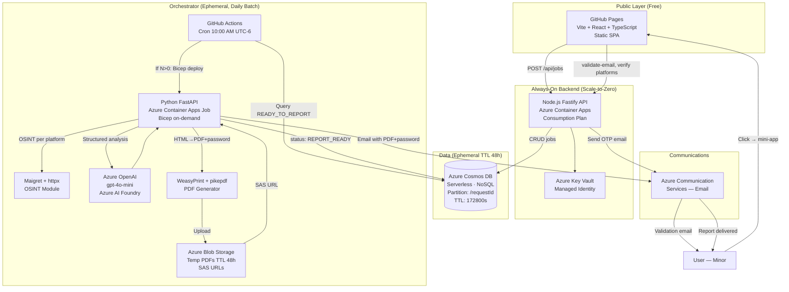
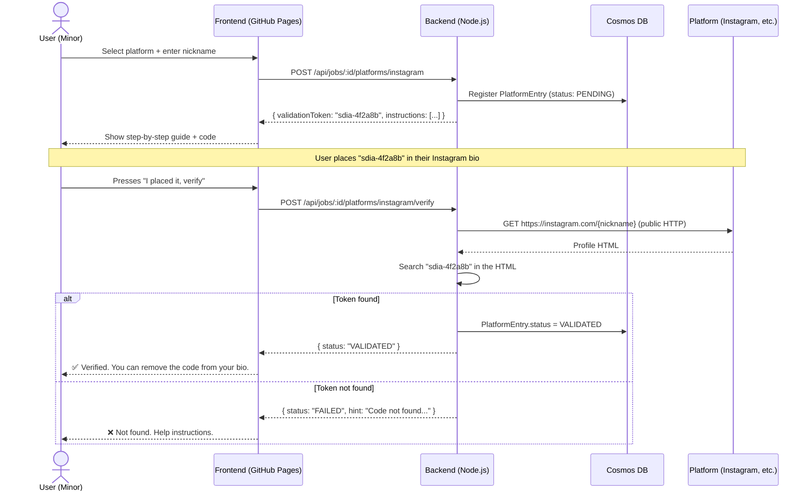

# SDIA — Architecture Document

> **ADR = Architecture Decision Record**  
> This document is the source of truth for all technical decisions.

---

## 1. General Architecture Diagram



---

## 2. Platform Validation Sequence Diagram



---

## 3. Report Generation Pipeline

```mermaid
flowchart LR
    A[Cosmos DB Query\nREADY_TO_REPORT jobs] --> B{N > 0?}
    B -->|No| C[Exit. No deploy.]
    B -->|Yes| D[Bicep: deploy ACA\nOrchestrator Job]
    D --> E[Per job\nin parallel]
    E --> F[OSINT: validated\nplatforms of the job]
    F --> G[clean_results\nnormalize findings]
    G --> H[build_prompt\nAtomic Inference]
    H --> I[Azure OpenAI\ngpt-4o-mini]
    I --> J[JSON: score,\nrisks, recommendations]
    J --> K[Jinja2 → HTML\nrender_report]
    K --> L[WeasyPrint\nHTML → PDF]
    L --> M[pikepdf\napply password+permissions]
    M --> N[Blob Storage\nSAS URL TTL 48h]
    N --> O[ACS Email\nPDF + password]
    O --> P[Cosmos DB\nstatus: REPORT_READY]
    P --> Q[Post-run: scale-to-zero]
```



---

## 4. Architecture Decision Records (ADRs)

### ADR-001: Database — Cosmos DB NoSQL vs. Azure SQL

**Context:** The system needs to store `AuditJob` with a variable number of `PlatformEntry` records (from 1 to potentially 50+). It also requires automatic TTL and low-latency isolated writes.

**Options evaluated:**

| Criterion | Azure SQL (PaaS) | Cosmos DB (Serverless) |
|-----------|-----------------|----------------------|
| Variable schema (1..N platforms) | JOIN tables required | Native JSON ✅ |
| Document-level automatic TTL | Not native (requires cron) | Native ✅ |
| Cost at rest | ~$5/month minimum | ~$0 (serverless) ✅ |
| Scale-to-zero | No | Yes ✅ |
| Operational complexity | High (migrations) | Low ✅ |
| Complex queries | Superior | Sufficient for SDIA |

**Decision:** **Azure Cosmos DB Serverless**, Core (SQL) API.

**Rationale:** The `PlatformEntry` schema is inherently variable (the user chooses which platforms to audit). Cosmos DB allows storing the array directly in the job document, eliminating JOINs. Native TTL guarantees auto-purge without additional cron. The Serverless model eliminates the fixed cost (~$0 at rest).

**Consequences:** Cosmos DB does not support complex multi-document transactions, but SDIA does not need them. All operations are on a single `AuditJob` per request.

---

### ADR-002: PDF Format — LLM → Markdown → HTML → PDF vs. DOCX → PDF

**Options evaluated:**

| Criterion | MD → HTML → PDF (WeasyPrint) | DOCX → PDF (LibreOffice) |
|-----------|------------------------------|--------------------------|
| Design control | Total (CSS) ✅ | Limited by Word styles |
| Visual traffic light (colors) | Native CSS ✅ | Complex with python-docx |
| Docker image size | +100MB (WeasyPrint deps) | +500MB (LibreOffice) |
| Native AES-256 password | pikepdf (5KB dep) ✅ | Requires additional step |
| Headless server generation | Pythonic / no GUI ✅ | Requires virtual display |
| Templates (Jinja2) | Standard web ✅ | Complex binary format |

**Decision:** **LLM → JSON → Jinja2 HTML → WeasyPrint PDF → pikepdf password**

**Password derivation algorithm:**
```python
import hashlib

def derive_pdf_password(email: str) -> str:
    """
    Derives the PDF password from the user's email.
    Result: 12 base62 readable characters.
    NEVER stored in the database.
    The password is sent only to the user's email.
    """
    hash_bytes = hashlib.sha256(email.lower().strip().encode('utf-8')).digest()
    b62_chars = "0123456789ABCDEFGHIJKLMNOPQRSTUVWXYZabcdefghijklmnopqrstuvwxyz"
    result = ""
    n = int.from_bytes(hash_bytes[:8], 'big')
    for _ in range(12):
        result += b62_chars[n % 62]
        n //= 62
    return result
# Example: "me@example.com" → "3xK9mP2wR7nQ"
```

**pikepdf permissions configuration:**
```python
from pikepdf import Encryption, Permissions
import os

Encryption(
    user=derive_pdf_password(email),
    owner=os.environ['PDF_OWNER_SECRET'],
    allow=Permissions(
        print_highres=True,      # Printing enabled
        modify_annotation=False,
        modify_assembly=False,
        modify_form=False,
        modify_other=False,
        extract=False,           # No text copying
    ),
    R=6  # AES-256
)
```

---

### ADR-003: Backend Hosting — Azure Container Apps vs. Azure Functions

**Decision:** **Azure Container Apps (Consumption)**

**Rationale:** The Node.js backend needs future WebSocket-readiness (real-time status updates), specific HTTP configuration (CORS, headers), and consistency with the orchestrator (same hosting type). Azure Functions has longer cold starts for Node.js containers and is better suited for short, isolated functions.

---

### ADR-004: Orchestrator Trigger — GitHub Actions Cron vs. Azure Function Timer

**Decision:** **GitHub Actions Cron** (MVP) → **Azure Function Timer** (v0.2)

**MVP rationale:** GitHub Actions is free for public repos, visible in the repo (open source transparency), and sufficient for the hackathon. The limitation (±5 min cron precision) is acceptable for the use case. The workflow deploys the orchestrator via Bicep if there are jobs, or terminates in <10 seconds if there is no work.

---

## 5. Required Environment Variables

### Backend (Node.js)
```bash
# Azure
COSMOS_ENDPOINT=https://sdia-cosmos.documents.azure.com:443/
COSMOS_KEY=              # Local dev only; production uses Managed Identity
ACS_CONNECTION_STRING=   # Azure Communication Services
AZURE_KEYVAULT_URL=https://sdia-kv.vault.azure.net/

# App
JWT_SECRET=              # Local dev only; production from Key Vault
NODE_ENV=development|production
PORT=3000
ALLOWED_ORIGINS=https://[org].github.io,http://localhost:5173
RATE_LIMIT_MAX=3
RATE_LIMIT_WINDOW_MS=3600000
```

### Orchestrator (Python)
```bash
# Azure
AZURE_OPENAI_ENDPOINT=https://sdia-aoai.openai.azure.com/
AZURE_OPENAI_DEPLOYMENT=gpt-4o-mini
AZURE_COSMOSDB_ENDPOINT=
BLOB_CONNECTION_STRING=
ACS_CONNECTION_STRING=

# PDF
PDF_OWNER_SECRET=        # Owner password for PDF (not the user password)

# OSINT
OSINT_REQUEST_TIMEOUT_S=15
OSINT_MAX_CONCURRENT=3
```

---

## 6. Detailed Directory Structure

```
self-digital-identity-audit/
├── frontend/
│   ├── src/
│   │   ├── pages/
│   │   │   ├── RegistrationPage.tsx     # F-01: Initial form
│   │   │   ├── ValidationPage.tsx       # F-02: Email link landing
│   │   │   ├── PlatformsPage.tsx        # F-03/F-04: Platforms dashboard
│   │   │   └── CompletePage.tsx         # F-06: Final confirmation
│   │   ├── components/
│   │   │   ├── RegistrationForm/
│   │   │   ├── PlatformCard/
│   │   │   ├── ValidationGuide/         # Step-by-step guides per platform
│   │   │   └── StatusBadge/
│   │   ├── api/
│   │   │   └── sdiaClient.ts            # Typed HTTP client
│   │   ├── hooks/
│   │   └── types/
│   │       └── audit.ts                 # Shared types (AuditJob, PlatformEntry)
│   ├── public/
│   ├── vite.config.ts
│   └── package.json
│
├── backend/
│   ├── src/
│   │   ├── routes/
│   │   │   ├── jobs.ts                  # POST /api/jobs, GET /api/jobs/:id
│   │   │   └── platforms.ts             # POST .../platforms, POST .../verify
│   │   ├── services/
│   │   │   ├── cosmosService.ts
│   │   │   ├── emailService.ts          # ACS integration
│   │   │   ├── tokenService.ts          # OTP + JWT
│   │   │   └── platformVerifier/
│   │   │       ├── index.ts
│   │   │       ├── instagram.ts
│   │   │       ├── tiktok.ts
│   │   │       ├── twitter.ts
│   │   │       ├── youtube.ts
│   │   │       ├── steam.ts
│   │   │       └── roblox.ts
│   │   ├── plugins/
│   │   │   ├── auth.ts                  # JWT verification plugin
│   │   │   ├── rateLimiter.ts
│   │   │   └── cors.ts
│   │   ├── schemas/                     # JSON Schemas for Fastify
│   │   └── server.ts
│   ├── Dockerfile
│   └── package.json
│
├── orchestrator/
│   ├── app/
│   │   ├── main.py                      # FastAPI app + process_jobs()
│   │   ├── osint/
│   │   │   ├── extractor.py             # Orchestrates OSINT per platform
│   │   │   ├── instagram.py
│   │   │   ├── tiktok.py
│   │   │   ├── twitter.py
│   │   │   ├── youtube.py
│   │   │   ├── steam.py
│   │   │   └── roblox.py
│   │   ├── ai/
│   │   │   ├── analyzer.py              # build_prompt + call_azure_openai
│   │   │   └── prompts.py               # Prompt templates
│   │   ├── report/
│   │   │   ├── generator.py             # render_report() orchestrator
│   │   │   └── pdf_protector.py         # pikepdf password + permissions
│   │   ├── storage/
│   │   │   ├── cosmos.py
│   │   │   └── blob.py
│   │   └── models/
│   │       └── schemas.py               # Pydantic models
│   ├── templates/
│   │   └── report.html                  # Jinja2 report template
│   ├── assets/
│   │   └── styles.css
│   ├── tests/
│   ├── Dockerfile
│   └── requirements.txt
│
├── infra/
│   ├── main.bicep
│   ├── modules/
│   │   ├── cosmosdb.bicep
│   │   ├── containerapp.bicep
│   │   ├── containerapp-job.bicep
│   │   ├── storage.bicep
│   │   ├── keyvault.bicep
│   │   └── acr.bicep
│   └── parameters/
│       ├── dev.bicepparam
│       └── prod.bicepparam
│
└── .github/workflows/
    ├── ci.yml
    ├── deploy-frontend.yml
    ├── deploy-backend.yml
    └── report-generator.yml
```
